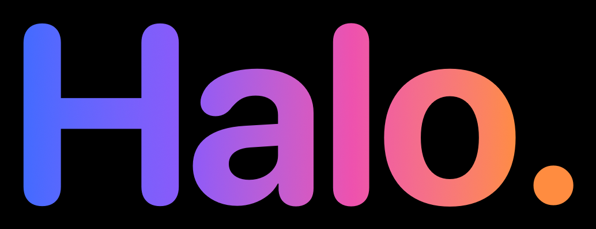
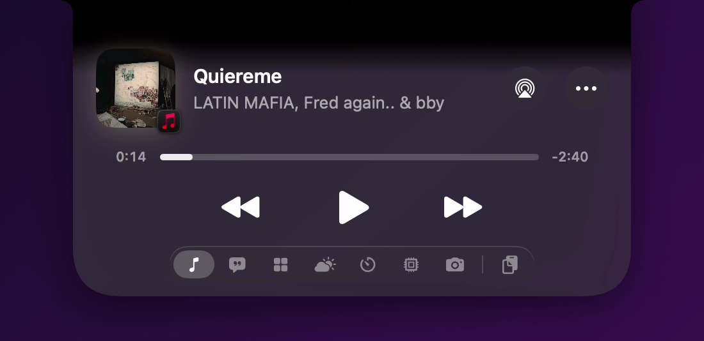
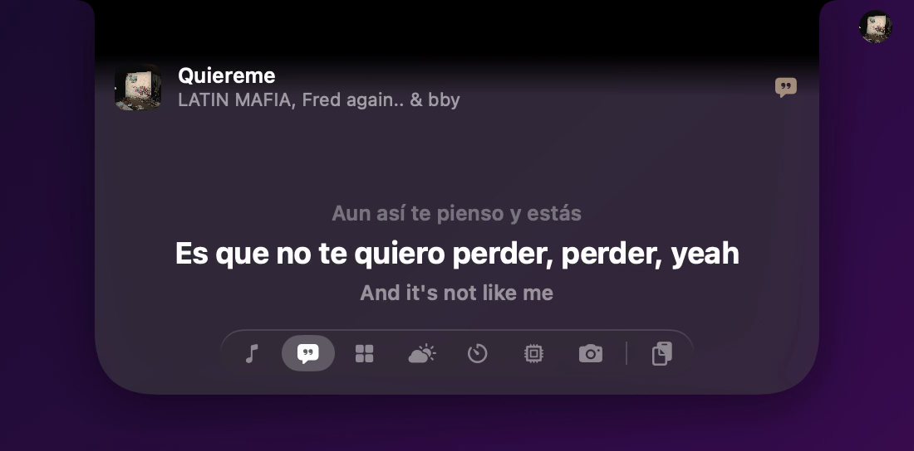
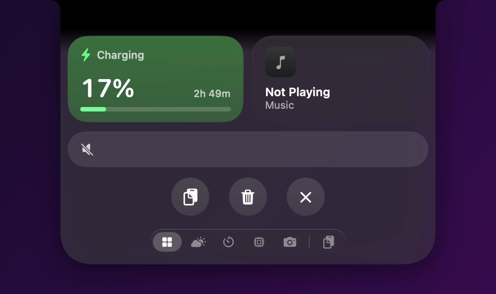
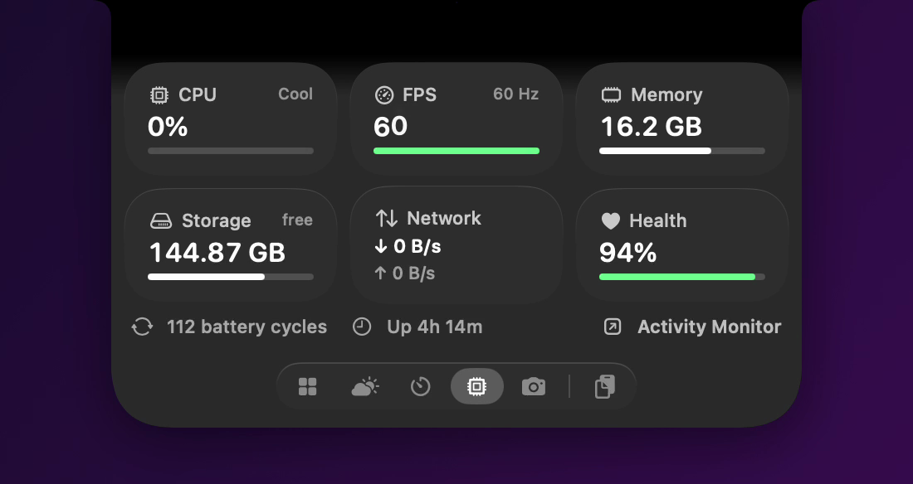
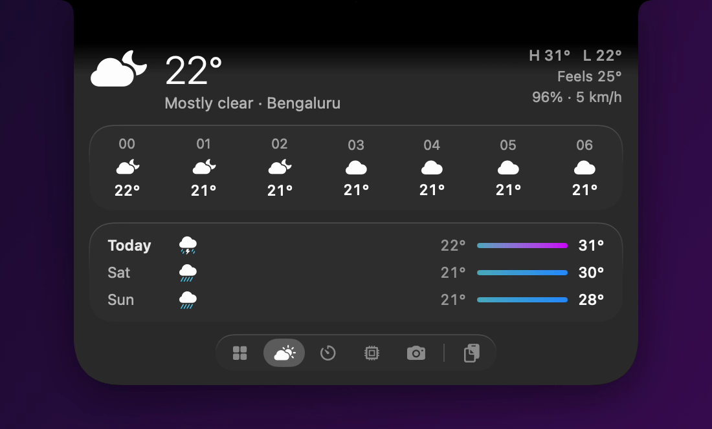
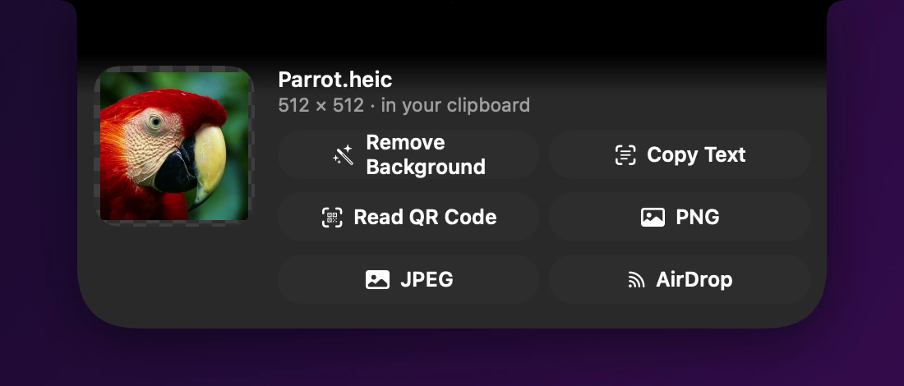
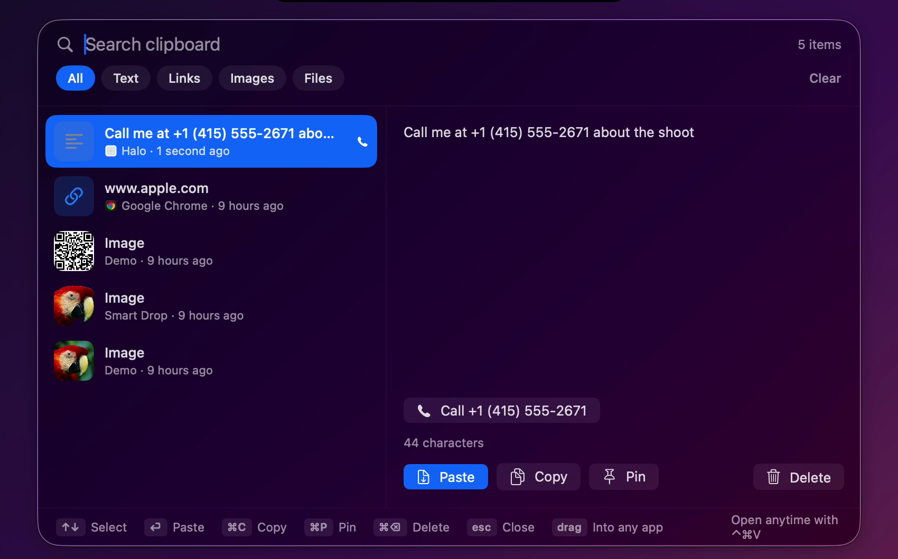
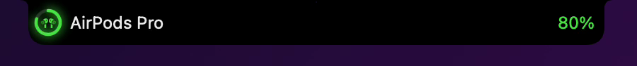
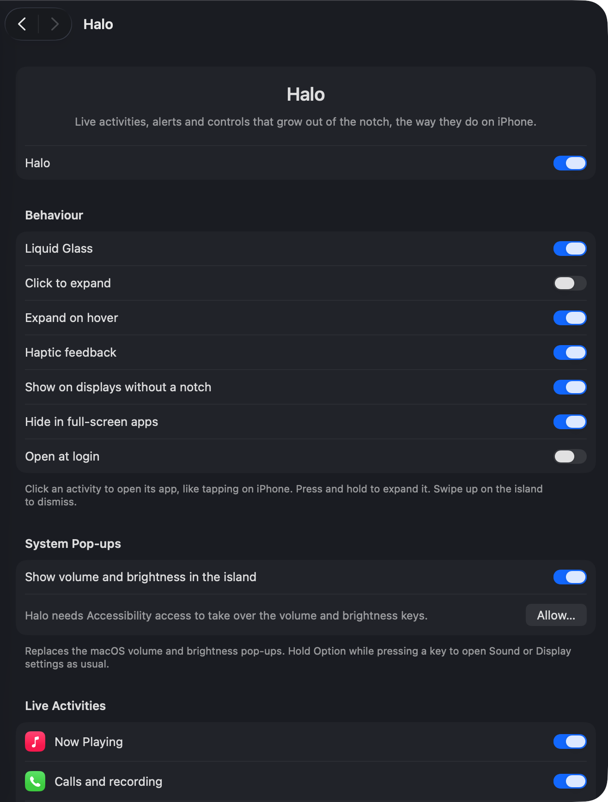

A Dynamic Island for the MacBook notch. It runs in the background with no Dock
or menu bar icon, lives in the notch, and grows when something happens, like the
iPhone's. Its settings are a page in System Settings.

## A look at it

Now Playing, with the controls in reach as soon as the island opens.



Lyrics, scrolling in time with the track.



Control Center — volume, brightness, media and shortcuts — without leaving the notch.



What your Mac is doing: CPU, memory, storage, network, battery health and uptime.



Weather, with the hours ahead and the next few days.



Smart Drop: drop an image on the notch and work on it right there — background
removal, QR codes, text, format conversion, AirDrop. All of it on-device.



Clipboard history, searchable, with actions it works out from what you copied —
a phone number offers to call it.



Alerts take the island over for a moment, then give it back.



Every switch lives in System Settings, where the rest of your Mac's settings are —
not in a menu bar icon or a window of its own.



## States

- **Compact**: content either side of the notch (artwork and waveform, a call timer).
- **Expanded**: a Liquid Glass card with the full controls. It grows out of the notch on a
  Core Animation spring (see `IslandBackdrop`), reaching full size in about 270 ms with the
  content arriving as it opens, and is drawn back in when it closes.
- **Split and minimal**: a second activity detaches into a small circle beside the island,
  and stays there as a dot while the first one is expanded.
- **Alerts**: short pop-ups that take over for a moment, then hand the island back.

## Smart Drop

Drop an image on the notch and Halo opens with tools that run entirely on your Mac
(Apple's Vision framework — nothing is uploaded):

- **Remove Background** — lifts the people, pets or objects out onto a transparent PNG.
- **Copy Text** — reads every line of text in the image and copies it.
- **Read QR Code** — decodes it and copies what it says; if it's a link, opens it too.
- **PNG / JPEG** — converts it.
- **AirDrop** — sends it.

Whatever it makes lands in the clipboard and on the pasteboard, ready for ⌘V, and can be
dragged straight out of the island. Other files are simply kept in the clipboard.

## Smart Clipboard

Copy a phone number, an email address or a street address, and Halo notices — a small
icon shows next to it in the clipboard list, and its own window offers the obvious next
step: **Call**, **Email** or **Open in Maps**. Worked out on-device with the same data
detectors Mail and Notes already use to underline a phone number; nothing is sent
anywhere to figure it out.

## Shortcuts and gestures

- **⌃⌘H** opens Halo (or what's live in it) and puts it away again. **⌃⌘V** opens the clipboard.
- **Swipe left or right** on a playing song to skip tracks; on an open card, to change pages.
- **Scroll** over the compact island to change the volume.
- **Click anywhere else** to put an open card away; otherwise it stays for a few seconds so there's time to reach it.

## Moving around

Every expanded page has a row of small icons along the bottom: **Now Playing**,
**Controls**, **Weather** and **Up Next** (when there's an event), then **Clipboard**.
Click one to jump there, or swipe left and right with two fingers on the island.

The Controls page is laid out like Control Center: two tiles, a volume slider, and up to
four small round clear-glass buttons. Everything on it is yours to choose in
System Settings → Dynamic Island → Controls Page:

- **Tiles**: Battery, Focus, Weather, Now Playing, Clipboard, or None (Battery and Focus by default).
- **Volume slider**: on or off.
- **Buttons**: up to 12, six to a row. Toggles light up white while on: Keep Awake (caffeinate,
  ends when Halo quits), Dark Mode, Night Shift, Mute, Mute Microphone, Wi-Fi, Bluetooth, Focus,
  Hide Dock, Hide Desktop Icons (restarts Finder). Actions: Clipboard, Screenshot, Color Picker
  (copies the hex), Show Desktop, Mission Control, Apps, Timer, Quick Note, Lock Screen, Sleep
  Display, Sleep, Eject All Disks, Empty Trash (asks first), Clear App Caches, Force Quit Apps,
  Weather, Halo Settings, Show Hidden Files, Clear Clipboard, AirDrop, Calculator, Activity
  Monitor, Internet Speed Test (Apple's networkQuality), Copy IP Address, Restart… and Shut Down…
  (macOS's own dialog, which you can cancel). Dark Mode and Hide Dock ask once to control System Events, Empty Trash
  to control Finder.
- **Tiles** can also be CPU and Memory, Timer, Quick Note, Date and Next Event, Network Speed, or Storage (click it to clear caches).
- **Clicking the island opens**: Now Playing (or Controls when nothing's playing), Controls, or Weather.

**Menu bar icons and menus.** The compact island measures the room between the notch and the
nearest menu bar icon on the right, and the frontmost app's menus on the left (menus need
Accessibility). It never grows past either. When one side is full — Chrome's menus run right up
to the notch — it grows only toward the other side and puts everything there. Short pop-ups like
volume can still reach past for a moment. Turn this off with "Keep clear of menu bar icons".

**Focus.** macOS only lets Shortcuts change Focus, so the Focus tile runs a shortcut named
"Island Focus" (Set Focus → Toggle Do Not Disturb, then Get Current Focus). The first tap
walks you through making it. Halo shows Focus as it was after its last toggle; it can't
see changes made from Control Center.

**When something finishes** (copied, added to a playlist, caches cleared, apps quit, Focus
changed) the island plays a Face ID-style confirmation: the face-frame corners spin in,
close into a ring and a checkmark draws itself.

The island is solid black like iPhone's. Liquid Glass is available in Settings.

## Pages

Switch each on in System Settings → Dynamic Island → Pages. Every page gets an icon in the row along the bottom.

| Page | What it does |
|---|---|
| Lyrics | The line being sung, with the lines before and after, synced to the song, from LRCLIB (free, no account). Plain lyrics scroll when a song has no timing. |
| Shortcuts | Run any shortcut from the Shortcuts app. |
| Timer | 1 minute to 90 minutes, a stopwatch, or Pomodoro (25 minutes of focus, 5-minute breaks, a 15-minute break after four). A running timer shows in the compact island (or as a ring beside it), and the island tells you when it ends. |
| System | CPU, frames per second (and the screen's refresh rate), memory, free storage, network speed, battery health and cycle count, uptime and temperature. |
| Reminders | Unfinished reminders, soonest first; tick them off, or add one in a small window. |
| Quick Note | A note that's always a click away, saved as you type; copy or clear it from the island. |
| Mirror | A live, mirrored camera view for a check before a call. The camera runs only while it's open. |

**Wellbeing.** Optional eye-break reminders (the 20-20-20 rule, every 20 minutes) and water
reminders (hourly), counted only while you're using the Mac.

## Motion

Plugging in plays iPhone's charging moment: a bolt bounces in over a ripple, the battery fills
to the level in green with a glow, and a band of light sweeps across it. Unplugging drops the bolt
and fades the charge back to white. Pages slide sideways in the direction you move, the highlight
in the icon row glides between icons, rows settle in one after another as a card opens, and
buttons bounce when pressed.

## Gestures

| Gesture | What it does |
|---|---|
| Click | Expands the activity. Turn off "Click to expand" for iPhone's behaviour, where a click opens the app instead. |
| Press and hold | Expands without opening the app |
| Swipe up | Dismisses the activity or alert until something new happens in it |
| Drag a file onto the notch | Keeps it in the clipboard |
| Click the island when idle | Controls for the last track, or battery, volume and quick actions |
| Right-click | Settings, Clipboard, Turn Off, Quit |

## Live activities

| Activity | Compact | Expanded |
|---|---|---|
| Now Playing (Music, Spotify, browsers, anything in Control Center) | Artwork, waveform in the artwork's colour (a pause glyph when paused) | Title, artist, draggable scrubber, previous / play-pause / next, and a ⋯ menu |
| Calls (FaceTime, iPhone calls through Continuity, Zoom, Teams, Meet, WhatsApp, Discord, Slack…) | Call timer, voice waveform | Mute microphone, open the app |
| Recording (Voice Memos, QuickTime, GarageBand, OBS…) | Red dot and duration | Open the app |
| Screen recording | Pulsing record icon and duration | Stop |
| Camera / microphone in use | Green / orange dots | |
| Next calendar event (off until switched on) | Countdown and title | Time, location, Join the video call, open in Calendar |
| Nothing running | — | Battery and time left, weather, volume slider, and icons for Clipboard, Clear App Caches and Force Quit |

## Alerts

Volume and brightness (replacing the macOS pop-ups), Caps Lock, charging, unplugging,
low battery, Low Power Mode, AirPods and Bluetooth devices with battery, AirPlay and
audio output changes, Wi-Fi / Personal Hotspot / Ethernet / no internet, AirDrop and
finished downloads, screenshots, and a marked event starting right now.

## The ⋯ menu

On the Now Playing card: favourite the song, add it to one of your playlists and show it
in Apple Music (these drive Music through AppleScript, so macOS asks once for permission),
plus copy the title and artist, save the artwork to the clipboard, search YouTube, open the
player, and hide the song until the next one. Every action reports back in the island,
including when it doesn't work.

Delete from Library is there too, behind a confirmation, since it can't be undone.

Music's own items that other apps can't reach — Pin Song, Download, Create Station,
Get Info, Suggest Less, Share — aren't there: Music doesn't expose them to scripting.

## Clipboard

One place for everything you'd want to paste or drag: what you copy, screenshots you
take, and files or images you drop on the notch. Press **⌃⌘V** anywhere (or the clipboard
icon on the control card) to open it: search, filter by Text / Links / Images / Files, and a
large preview of whatever is selected. Drag any item straight into another app.

| Key | Does |
|---|---|
| ↑ ↓ | Select |
| ⏎ | Paste into the app you were using (needs Accessibility; otherwise it copies and tells you to press ⌘V) |
| ⌘C | Copy |
| ⌘P | Pin, so Clear leaves it alone |
| ⌘⌫ | Delete |
| esc | Close |

The island shows "✓ Copied" each time you copy (click it to open the clipboard), a card
for each new screenshot, and a "Drop to keep it" card while you drag something over the
notch. History is kept in memory only (up to 60 items), and anything a password manager
marks as private is never recorded. The shortcut uses the Carbon hot key API, so it needs
no permission.

## Clear app caches

The trash icon on the control card frees storage by clearing `~/Library/Caches`. It
shows how much first and asks. It leaves alone the caches of apps that are open (matched
by app ID, company folder like "Google", or app name), macOS services, and downloads like
Playwright's browsers that you'd have to reinstall. System caches need an administrator
password and aren't touched.

## Weather

Current conditions, the next hours and three days, from Open-Meteo (free, no account),
on the control card and in its own card. Leave the city empty to use your location — or
your time zone's city, since a locally-signed app often never gets the location prompt —
or type a city in Settings.

## Full screen

The island hides itself while an app is full screen (detected from the frontmost app's
window covering the display below the notch band) — a video, a game, a presentation —
and comes back when you leave. Turn it off with "Hide in full-screen apps".


## What a Mac can't show

Phone call answer/decline, SIM alerts, Face ID, Apple Pay, NFC, CarKey, Find My,
Maps navigation and third-party Live Activities are iPhone features. macOS gives
no app access to them, so Halo doesn't pretend to.

## Permissions

Halo only asks for a permission the first time you use the feature it's for — nothing is
requested up front. What each one is for:

- **Accessibility**, to take over the volume and brightness keys and measure app menus for
  the compact island. Settings has an Allow button if you skip the prompt.
- **Bluetooth**, for AirPods and other device alerts.
- **Automation (Apple Events)**, to control Music for song actions, System Events for Dark
  Mode and the Dock, and Finder to empty the Trash — asked once per app, only when you use
  that action.
- **Calendars** and **Reminders**, for the Up Next card and the Reminders page.
- **Location**, for local weather (skip it and Halo falls back to your time zone's city, or
  a city you type in Settings).
- **Camera**, for the Mirror page only — nothing is recorded.
- **Desktop** and **Downloads** folders, for screenshots landing on the Shelf and AirDrop /
  download alerts.

Building it yourself means an unsigned, locally-built app, so macOS re-asks for
Accessibility and Bluetooth after every rebuild — expected, not a bug.

## Requirements

- macOS 26 or later.
- Apple silicon or Intel.
- Xcode Command Line Tools — no full Xcode install needed.

## Setup

No Xcode, no App Store, no signing certificate — just the Command Line Tools and one
script.

1. **Open Terminal** (⌘Space, type "Terminal", press Enter ).
2. **Install the Command Line Tools**, if you haven't already:
   ```bash
   xcode-select --install
   ```
   Skip this if a dialog doesn't appear — it means you already have them.
3. **Get the code and build it:**
   ```bash
   git clone https://github.com/niranjan6030/Halo.git
   cd Halo
   Scripts/build-app.sh install
   ```
   This compiles Halo with Swift Package Manager, installs `/Applications/Halo.app` and
   `~/Library/PreferencePanes/Halo.prefPane` (its System Settings page), and launches it.
   The first build takes a minute or two; the notch should come alive shortly after.
4. **Allow the permissions Halo asks for.** It only asks the first time you actually use
   a feature, never up front — see [Permissions](#permissions) below for what each one is
   for. It's fine to click "Don't Allow" on anything you don't want; that feature just
   stays off.
5. **Open Halo's own settings** whenever you want to change something:
   -  System Settings → scroll down the sidebar to **Halo** (near the bottom, below the
      regular system panes) → click it.
   -  Or right-click the island in the notch → **Halo Settings…**.

   That's the whole interface — there's no separate Halo app window, menu bar icon, or
   Dock icon to look for.

That's it — nothing to configure before it works. Everything in [Moving around](#moving-around)
and [Pages](#pages) above is optional, switched on from that same Settings page.

Since the build is signed locally rather than notarized, macOS won't show a Gatekeeper
warning for a version you build yourself this way (that warning is only for files
downloaded through a browser). After pulling new changes, rebuild with:
```bash
cd Halo && git pull && Scripts/build-app.sh install
```
Just want to look without installing? `Halo --snapshots <dir>` renders every state to PNGs.

### Uninstalling

```bash
rm -rf /Applications/Halo.app ~/Library/PreferencePanes/Halo.prefPane
defaults delete com.niranjan.Halo 2>/dev/null
```

## How it works

- **Now playing.** Since macOS 15.4, MediaRemote only answers processes Apple trusts.
  `Helper/HaloMedia.m` is a small library that `/usr/bin/perl`, an Apple platform
  binary, loads and runs. It streams track info as JSON lines and takes commands on stdin.
- **Settings.** `Sources/HaloCore` holds the preferences and the settings screen, shared
  by the app and the System Settings page. They sync through distributed notifications.
- **Calls and recording.** Core Audio reports which processes are recording; that is
  matched against known call and recording apps.
